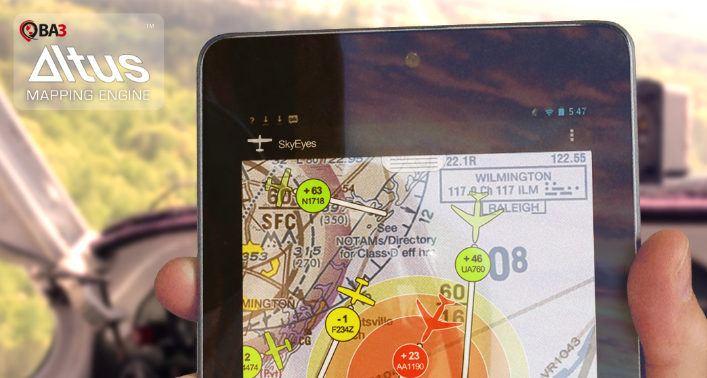

The BA3 Altus Mapping Engine(TM) is a high-performance library designed for Android developers who are creating
both simple and demanding mapping apps for Android 4.0 or higher.

Developers using things like MapKit and Route-Me generally run into performance,
capacity or feature walls that block development, and the Altus Mapping Engine can eliminate those walls.

Get the BA3 Altus Android SDK and Sample Applications
======================================================

Complete source code is supplied for all of the Altus Mapping Engine tutorials, 
and the tutorials themselves can be found in the 
<a href="http://www.ba3.us/?page=pages/knowledge-base">Knowledge Base</a>.

If this is your first time using these tutorials and you want to access the source code,
go to a command prompt and run these commands:

<pre>
git clone https://github.com/ba3llc/AltusMappingEngineAndroid.git
cd AltusMappingEngineAndroid
</pre>

<b>About once a week, the SDK is updated with a new build of the Altus Mapping Engine,
any new tutorials and any necessary corrections.</b>

If it has been several weeks since you started the tutorials, or if you cannot checkout one of the tutorials,
you should get the latest version. To get the latest version, type:

<pre>
git checkout master
git pull
</pre>

Once you do that, you can checkout any of the tutorials as usual. 

You can learn more about the BA3 Altus Mapping Engine at <a href="http://ba3.us">BA3.us</a>. Questions? Please send them to info@ba3.us
